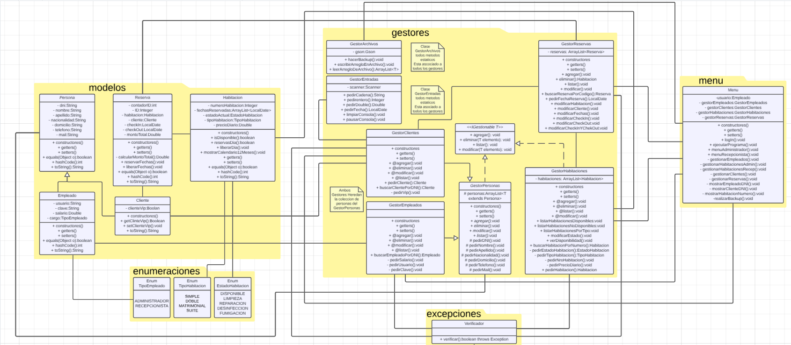
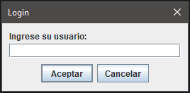
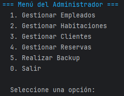

# 🌟 Sistema de Gestión de Hotel 🏨

Este proyecto consiste en el desarrollo de un sistema integral de gestión hotelera, diseñado para optimizar y simplificar las tareas administrativas relacionadas con la gestión de habitaciones, clientes, empleados y reservas. 

El objetivo principal es proporcionar una herramienta funcional que facilite la operación diaria de un hotel, permitiendo un manejo eficiente de los recursos y mejorando la experiencia tanto de los usuarios internos como de los clientes finales. 

Este sistema fue desarrollado como parte de un proyecto académico en el marco de los estudios realizados en la **Universidad Tecnológica Nacional - Facultad Regional Mar del Plata (UTN FRMDP)**. El proyecto refleja el aprendizaje y la aplicación práctica de conocimientos adquiridos en áreas clave como desarrollo de software, bases de datos, y diseño de sistemas.

---

## 👩‍💻 Equipo 👩‍💻

- [Barreiro Julian](https://github.com/JulianBarreiro2k) Front-End Senior
- [Daverio Emiliano](https://github.com/Yoru3971) Back-End Beast
- [Intelangelo Felipe](https://github.com/FelipeIntelangelo) Just me
- [Dicostanzo Nahuel](https://github.com/nahueldico3) We dont need to talk about it

---

## ✨ Funcionalidades principales ⚒️

- 🛏️ **ABM de habitaciones**: Crear, modificar, eliminar y listar habitaciones.
- 👥 **ABM de clientes**: Gestionar la información de los huéspedes del hotel.
- 🧑‍💼 **ABM de empleados**: Registrar y administrar datos del personal del hotel.
- 📅 **Gestión de reservas**: Crear y administrar reservas de habitaciones. 

---

## 🛠️ Tecnologías utilizadas 🛠️

- **Backend**: [Java]
- **Frontend**: [Swing]
- **Base de datos**: [Gson]
- **Control de versiones**: [Git y GitHub]

---

## 🚀 Instalación

1. Clona el repositorio:
   ```bash
   git clone https://github.com/Yoru3971/TP-Final-Programacion-II
   ```
2. Configura las variables de entorno (si aplica):
   ```bash
   - Abre y busca el archivo de empleados - Elige un administrador para ingresar al sistema o cree uno con el mismo formato del .json
   ```
4. Ejecuta el proyecto:
   ```
   Abre el ejecutable con nombre -> SistemaHotel.bat
   ```
---
📜 UML 📜

---
## 🖥️ Manual De Uso 🖥️



Despues te va a pedir la contraseña con el mismo diseño.




A partir de este punto ya no creo que sea necesario explicar mas, es bastante intuitivo el programa.
Al recorrerlo se sobre entiende todo, eso si, recordar cerrar el programa volviendo a los menues y cerrando A MANO,
en el caso que cierren el programa abruptamente los archivos no se modificaran.

---

## 🤝 Contribuciones 🤝

Si deseas contribuir, por favor, abre un *issue* o envía un *pull request*. ¡Toda ayuda es bienvenida!
Recordarles que somos un equipo pequeño que tuvo poco tiempo en el desarrollo del proyecto.

## 📜 Licencia 📜
Licencia Personal a nombre del grupo.
Licencia de la UTN - Licenciatura en Programacion

✨ Muchas gracias por la cursada [Lucre y Adrian] ✨

---
